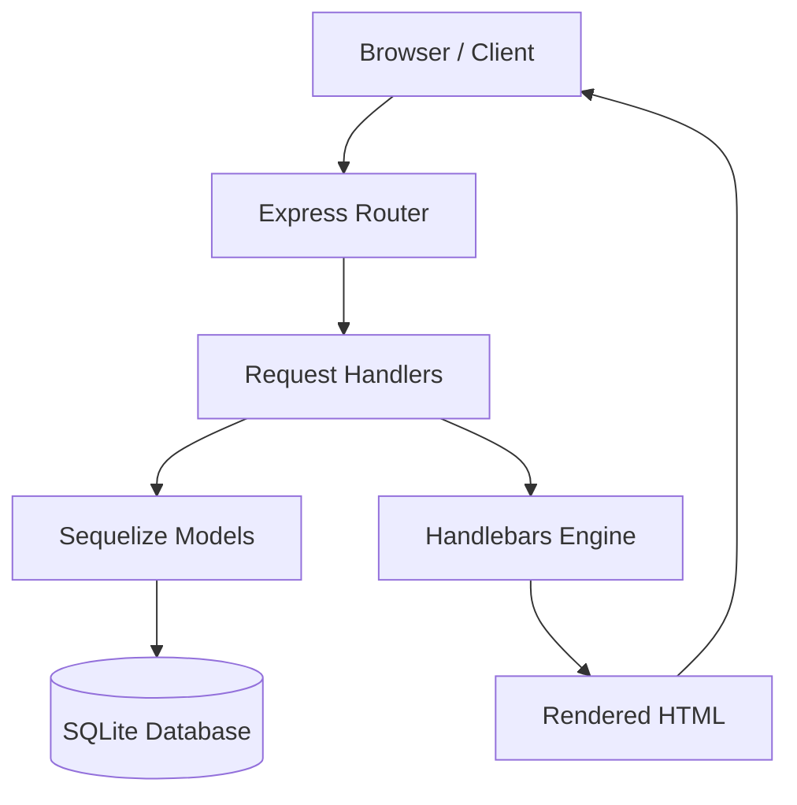

# TaskManager Pro
> **Sistema de Gestion de Tareas (CRUD) - Arquitectura Empresarial con Node.js y TypeScript**

[](https://www.typescriptlang.org/)
[](https://nodejs.org/)
[](https://expressjs.com/)
[](https://www.sqlite.org/)
[](https://sequelize.org/)

---

## Vision General

TaskManager Pro es una solucion robusta para la gestion de flujos de trabajo personales, desarrollada bajo los mas altos estandares de ingenieria de software. El sistema implementa un patron MVC (Model-View-Controller) utilizando Programacion Orientada a Objetos (POO) en TypeScript, garantizando un codigo mantenible, escalable y con tipado fuerte.

Originalmente concebido para entornos NoSQL, el sistema ha sido optimizado para utilizar SQLite mediante el ORM Sequelize, ofreciendo una solucion ligera pero potente para almacenamiento relacional.

---

## Arquitectura del Sistema

El proyecto sigue una estructura desacoplada donde la logica de servidor esta encapsulada en una clase Application.

### Flujo de Datos Tecnico


---

## Stack Tecnologico (Senior Grade)

| Capa | Tecnologia | Justificacion Tecnica |
| :--- | :--- | :--- |
| **Runtime** | Node.js (v18+) | Entorno asincrono de alto rendimiento. |
| **Language** | TypeScript | Tipado estatico para prevenir errores en tiempo de diseño. |
| **Framework** | Express.js | Minimalismo y extensibilidad para servicios web. |
| **Database** | SQLite3 | Almacenamiento local persistente sin necesidad de servidores externos. |
| **ORM** | Sequelize | Abstraccion de base de datos para prevenir SQL Injection y facilitar migraciones. |
| **Templating** | Handlebars (HBS) | Separacion clara entre logica de negocio y presentacion visual. |

---

## Estructura del Proyecto

```text
src/
├── database.ts      # Configuracion y conexion a SQLite
├── app.ts           # Clase principal de la aplicacion (Settings, Middlewares, Routes)
├── index.ts         # Punto de entrada (Bootstrap)
├── config.ts        # Gestion de variables de entorno
├── models/          # Definicion de esquemas de datos (Sequelize)
├── routes/          # Definicion de endpoints y logica de enrutamiento
└── views/           # Interfaz de usuario (Plantillas .hbs)
    ├── layouts/     # Estructuras base compartidas
    ├── partials/    # Componentes UI reutilizables
    └── tasks/       # Vistas especificas del dominio de tareas
```

---

## Inicio Rapido

### 1. Clonacion e Instalacion
```bash
git clone <repository-url>
cd UD_prueba
npm install
```

### 2. Configuracion de Entorno
Crea un archivo .env en la raiz del proyecto:
```env
PORT=3000
DB_STORAGE=./database.sqlite
```

### 3. Ejecucion
```bash
# Modo Desarrollo (Con hot-reload)
npm run dev

# Compilacion y Produccion
npm run build
npm start
```

---

## Documentacion de Rutas (Endpoints)

| Ruta | Metodo | Descripcion | Vista |
| :--- | :--- | :--- | :--- |
| `/tasks/list` | `GET` | Visualizacion de todas las tareas. | `tasks/list` |
| `/tasks/create` | `GET/POST` | Formulario y logica de creacion. | `tasks/create` |
| `/tasks/edit/:id` | `GET/POST` | Recuperacion y actualizacion de datos. | `tasks/edit` |
| `/tasks/delete/:id` | `GET` | Eliminacion logica/fisica de registros. | N/A |

---

## Analisis de Arquitecto

### Seguridad y Mantenibilidad
- **Abstraccion de Datos**: El uso de Sequelize protege automaticamente contra ataques de Inyeccion SQL mediante el uso de consultas parametrizadas.
- **Tipado de Modelos**: Las interfaces de TypeScript aseguran que los objetos de tarea mantengan la integridad estructural en todo el ciclo de vida de la peticion.
- **Modularidad**: La separacion de rutas por dominio permite escalar el sistema añadiendo nuevos modulos sin afectar el nucleo del servidor.

### Futuras Mejoras (Roadmap)
1. **Autenticacion**: Implementacion de JWT o sesiones con Passport.js.
2. **API REST**: Exposicion de endpoints JSON para consumo desde frameworks SPA (React/Vue).
3. **Validacion de Esquemas**: Integracion de Zod o Joi para validacion estricta de req.body.

---

> [!IMPORTANT]
> **Nota de Version:** Este proyecto ha migrado de MongoDB a SQLite para mejorar la portabilidad y simplicidad en entornos de desarrollo local. Asegurese de tener permisos de escritura en el directorio raiz para la creacion del archivo .sqlite.

---
**Desarrollado con Excelencia Tecnica**
