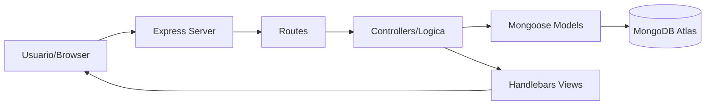

# TaskManager Pro - CRUD UD
> **Desarrollo Back End - Nivel Intermedio | Proyecto Final "Todos a la U"**

[](https://www.typescriptlang.org/)
[](https://nodejs.org/)
[](https://expressjs.com/)
[](https://www.mongodb.com/)

---

## Visión General

Este proyecto es un sistema de gestión de tareas (CRUD) robusto diseñado con una arquitectura modular y escalable. Implementa patrones modernos de desarrollo en el ecosistema de Node.js, priorizando el tipado fuerte y la mantenibilidad del código.

## Arquitectura del Sistema

El sistema sigue una estructura **MVC (Model-View-Controller)** adaptada para TypeScript, desacoplando la lógica de negocio de la presentación.

### Flujo de Datos


## Stack Tecnológico

| Componente | Tecnología | Propósito |
| :--- | :--- | :--- |
| **Core** | Node.js & TypeScript | Entorno de ejecución y tipado estático. |
| **Framework** | Express.js | Manejo de servidor HTTP y enrutamiento. |
| **Base de Datos** | MongoDB | Almacenamiento NoSQL documental. |
| **ODM** | Mongoose | Modelado de objetos y validación de esquemas. |
| **Template Engine** | Handlebars (HBS) | Renderizado de vistas dinámicas en el servidor. |
| **Middleware** | Morgan | Logging de peticiones HTTP en desarrollo. |

## Inicio Rápido

### Requisitos Previos
- [Node.js](https://nodejs.org/) (v16.x o superior)
- [npm](https://www.npmjs.com/)
- Cuenta en [MongoDB Atlas](https://www.mongodb.com/cloud/atlas) o instancia local de MongoDB.

### Instalación

1. **Clonar el repositorio:**
   ```bash
   git clone <url-del-repo>
   cd UD_prueba
   ```

2. **Instalar dependencias:**
   ```bash
   npm install
   ```

3. **Configurar variables de entorno:**
   Crea un archivo `.env` basado en el ejemplo proporcionado:
   ```bash
   cp .env.example .env
   ```
   *Edita el archivo `.env` con tu URI de conexión a MongoDB.*

4. **Ejecutar en desarrollo:**
   ```bash
   npm run dev
   ```

## Scripts Disponibles

- `npm run dev`: Inicia el servidor con **Nodemon** y **ts-node** para desarrollo rápido.
- `npm run build`: Compila el código TypeScript a JavaScript en la carpeta `/dist`.
- `npm run start`: Inicia la aplicación en modo producción desde `/dist`.
- `npm run clean`: Elimina los artefactos de compilación.

---

## Mejores Prácticas Aplicadas

1. **Tipado Estricto**: Uso extensivo de interfaces y tipos de TypeScript para reducir errores en tiempo de ejecución.
2. **Separación de Responsabilidades**: Lógica de aplicación, rutas y base de datos desacopladas en la clase `Application`.
3. **Seguridad de Configuración**: Uso de variables de entorno para proteger credenciales sensibles.
4. **Clean Code**: Nombramiento semántico y estructura de archivos organizada por dominio.

---

> [!NOTE]
> Este proyecto fue desarrollado como parte del programa de formación **Todos a la U** para el nivel intermedio de desarrollo Back-End.

---
Developed with respect by [Your Name/Team]
